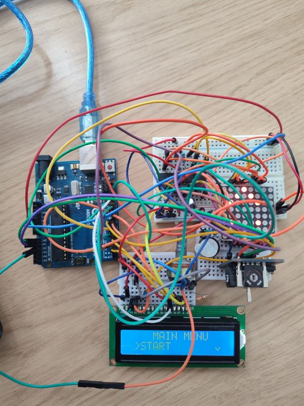

# Matrix Project - Bomberman

This is a project aimed at creating a game using both hardware components (Arduino, Matrix LED, etc.) and software. This is a simpler representation of the Bomberman game.

## Hardware Components
For this project, I needed a wider range of electronic components.
* Arduino Uno
* Led Matrix 8x8
* MAX2719 driver for controll the matrix
* Joystick
* Buzzer
* Potentiometer (to adjust the brightness of the LCD in settings)
* LCD Display

## Menu

The main menu consists of the following sections:
* **Start** - start the game
* **Settings** - Enter in submenu for the settings.
* **Highscore** - Show top 3 players
* **Game info** - Some game information
* **About** - Information about author
* **Difficulty** - set hard/easy

The settings menu consists of the following sections:
* **LCD Brightness** - Adjust the brightness of the LCD display with the potentiometer.
* **Matrix Brightness** - Adjust the brightness of the Matrix
* **Set Name** - Set the name for player
* **Reset highscore** - Reset top 3 players 
* **Sound on/off** - enable/disable the sound 

## Game

At the beginning of the game, an introductory message will appear on the display: *'Welcome to Bomberman!*'  

The goal of the game is **to break** the walls on the map while avoiding losing lives in the event the player is within the explosion range of a bomb.

The player can move across the map **(16x16)**, trying to destroy as many walls as possible (press the joystick button to put a bomb). Each destroyed wall represents an additional point for the score.

While the player is playing the game, the LCD will display the score, lives, player's name, and difficulty.

If, at the moment the player has won/lost, their score is higher than the lowest in the high score, it will be placed in the correct position in the ranking.

The **hard mode** involves reducing the time it takes for the bomb to explode.

Link with the video [here](https://www.youtube.com/watch?v=Arrk1L0kSHA) and [here](https://www.youtube.com/shorts/WdDUPrJpUUY)

Image with setup

